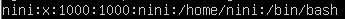
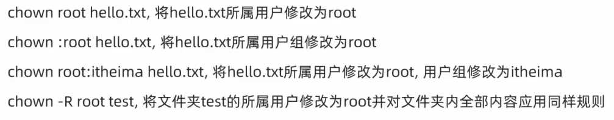

# history命令，查看历史输入命令
可以通过：！命令前缀，自动执行上一次匹配前缀的命令
# ls命令
## 语法： `ls [-a -l -h] [linux路径]`
ls命令来自英文 **list directory(列出目录内容)\[lɪst]\[də'rektərɪ]**
当不使用选项和参数，直接使用ls命令本体，表示以平埔形式，列出当前[工作目录](../linux/基础知识.md#工作目录)下的内容。
## 各选项含义
- \-a选项，表示：al的意思，即列出全部文件（包含隐藏的文件/文件夹)
	- 图中以.开头的，表示是Liux系统的隐藏文件/文件夹（只要以.开头，就能自动隐藏)
	- 只有通过\-a选项，才能看到这些隐藏的文件/文件夹
- \-l选项，表示：以列表（竖向排列）的形式展示内容，并展示更多信息
- -h选项，表示以易于阅读的形式，列出文件大小，如K、M、G
	**- -h选项必须要搭配-l一起使用**
# cd命令
## 语法：`cd [Linux路径]`
当LiuX终端（命令行)打开的时候，会默认以用户的HOME目录作为当前的工作目录

我们可以通过cd命令，更改当前所在的[工作目录](../linux/基础知识.md#工作目录)。
- cd命令来自英文：**Change Directory(改变当前工作目录)**
- cd命令无需选项，只有参数，表示要切换到鄂个目录下
- cd命令直接执行，不写参数，表示回到用户的HOME目录
# pwd命令
## 语法：`pwd`
通过ls来验证当前的[工作目录](../linux/基础知识.md#工作目录)，其实是不恰当的。我们可以通过pwd命令，来查看当前所在的工作目录。
- pwd命令来自：**Print Work Directory(打印工作目录)**
- pwd命令，无选项，无参数，直接输入pwd即可
# mkdir命令
## 语法：`mkdir [-p] Linux路径(可以多个)`
通过mkdir命令可以创建新的目录（文件夹）
mkdir:来自英文：**Make Directory(做目录)**\[meɪk] 
- **参数必填**，表示Liux路径，即要创建的文件夹的路径，相对路径或绝对路径均可
- -p选项可选，表示自动创建不存在的父目录，适用于创建连续多层级的目录
## -p 选项
在创建文件夹时，如果使用的是个错误的路径，文件夹就将无法创建文件。
但是，使用-p选项，则能将一整个文件夹链条都创建完成。
# touch命令
## 语法：`touch Linuxi路径`
可以通过touch命令创建文件
英文：**touch(处理)\[tʌtʃ]** 
- touch命令无选项，参数必填，表示要创建的文件路径，相对、绝对、特殊路径符均可以使用
# cat命令
## 语法：`cat Linux路径`
英文：**cat\[kæt]**
准备好文件内容后，可以通过cat查看内容。
- Cat同样没有选项，只有必填参数，参数表示：被查看的文件路径，相对、绝对、特殊路径符都可以使用
# more命令
## 语法：`more Linux路径`
- 同样没有选项，只有必填参数，参数表示：被查看的文件路径，相对、绝对、特殊路径符都可以使用

more命令同样可以查看文件内容，同cat不同的是：
- cat是直接将内容全部显示出来
- more支持翻页，如果文件内容过多，可以一页页的展示
	- 在查看的过程中，通过空格翻页
	- 通过q退出查看

**只能查看文件**
# cp命令
## 语法：`cp  [-r]  参数1  参数2`
Cp命令可以用于复制文件\文件夹
Cp命令来自英文单词：**Copy\[ˈkɑːpi]**
- r选项，可选，用于复制文件夹使用，表示递归
- 参数1，Liux路径，表示被复制的文件或文件夹
- 参数2，Liux路径，表示要复制去的地方
# mv命令
## 语法：`mv  参数1  参数2`
mv命令可以用于移动文件\文件夹
mv命令来自英文单词：**move\[muːv]** 
- 参数1，Liux路径，表示被移动的文件或文件夹
- 参数2，Liux路径，表示要移动去的地方，如果目标不存在，则进行改名，确保目标存在
# rm命令
## 语法：`rm  [-r -f]  参数1  参数2...参数N`
rm命令可用于删除文件、文件夹
rm命令支持[ 通配符](../linux/基础知识.md#通配符) \*，用来做模糊匹配
rm命令来自英文单词：**remove\[rɪ'muːv](去污剂)**
- 同cp命令一样，-r选项用于删除文件夹
- \-f 表示**force\[fɔːrs]** ,强制删除（不会弹出提示确认信息）
	- 普通用户删除内容不会弹出提示，只有root管理员用户刷除内容会有提示
	- 所以一般普通用户用不到 -f 选项
- 参数1、参数2、、参数N表示要副除的文件或文件夹路径，**按照空格隔开**
# which命令
## 语法：`which 要查找的命令`
英文: **which\[wɪtʃ]** 
我们可以通过which命令，查看所使用的一系列[Linux命令](../linux/基础知识.md#Linux命令)的程序文件存放在哪里
# find命令
## 语法：`find 起始路径 -name "被查找文件名"`
在Linux系统中，我们可以通过find命令去搜索指定的文件。
- 被查找文件名，支持使用[ 通配符](../linux/基础知识.md#通配符)来做模糊查询。
## 语法：`find 起始路径 -size +l -n[kMG]`
- +、-表示大于和小于
- n表示大小数字
- kMG表示大小单位，k(小写字母)表示kb,M表示MB,G表示GB
- 例如：
	- 查找小于10KB的文件：find / -size -10k
	- 查找大于100MB的文件：find / -size +100M
	- 查找大于1GB的文件：find / -size +1G
# grep命令
## 语法：`grep [-n] 关键字 文件路径`
通过grep命令，从文件中通过关键字过滤文件行。
- 选项-n，可选，表示在结果中显示匹配的行的行号
- 参数，关键字，必填，表示过滤的关键字，带有空格或其它特殊符号，建议使用 ” ” 将关键字包围起来
- 参数，文件路径，必填，表示要过滤内容的文件路径，可作为内容输入端口
# wc命令
## 语法：`wc [-c-m-1-w] 文件路径`
通过WC命令统计文件的行数、单词数量等
- 选项，-C 统计bytes数量
- 选项，-m 统计字符数量
- 选项，-l 统计行数
- 选项，-W 统计单词数量
- 参数，文件路径，被统计的文件，可作为内容输入端口
# echo命令
## 语法：`echo 输出的内容`
使用echo命令在命令行内输出指定内容,和print输出函数相似。
- 无需选项，只有一个参数，表示要输出的内容，复杂内容可以用””包围
- 带有空格或\等特殊符号，建议使用双引号包围
	- 因为不包围的话，空格后很容易被识别为参数2，尽管cho不受影响，但是要养成习惯
# tail命令
## 语法：`tail [-f -num] Linux路径`
使用til命令，可以查看文件尾部内容，跟踪文件的最新更改
- 参数，Liux路径，表示被跟踪的文件路径
- 选项， \-f,表示持续跟踪
- 选项，-num(数字),表示，查看尾部多少行，不填默认10行
# su命令与exit命令
## 语法：`su【-】【用户名]`
su命令就是用于账户切换的系统命令
其来源英文单词Switch User\['juːzər] (切换用户)
- \- 符号是可选的，表示是否在切换用户后加载环境变量，建议带上
- 参数：用户名，表示要切换的用户，用户名也可以省略，省略表示切换到root
- 切换用户后，可以通过exit命令退回上一个用户，也可以使用快捷键：ctrl+d
- 使用普通用户，切换到其它用户需要输入密码，如切换到root用户
- 使用root用户切换到其它用户，无需密码，可以直接切换
# sudo命令
## 语法：`sudo 其它命令`
- 在其它命令之前，带上Sudo,即可为这一条命令临时赋予root授权
- 但是并不是所有的用户，都有权利使用sudo,我们需要为普通用户配置sudo认证
# getent命令
## 语法：`getent passwd`
使用getenti命令，可以查看当前系统中有哪些用户

用户名：密码(X):用户ID:组ID:描述信息（无用）：HOME目录：执行终端（默认bash)
## 语法：`getent group`
使用getent命令，可以查看当前系统中有哪些用户组

组名称：组认证（显示为x):组D
# chmod命令
## 语法：`chmod [-R] 权限文件或文件夹`
可以使用chod命令，修改文件、文件夹的权限信息。
注意，只有文件、文件夹的所属用户或oot用户可以修改。
- 选项：-R,对文件夹内的全部内容应用同样的操作
- chmod -R u=rwX,g=rX,O=x test  ,将文件夹test以及文件夹内全部内容权限设置为：rWXr-X--X
- 除此之外，还有快捷写法：chmod 751 hello.txt
# chown命令
## 语法：`chown [-R] [用户] [:] [用户组]文件或文件夹`
使用chown命令，可以修改文件、文件夹的所属用户和用户组
普通用户无法修改所属为其它用户或组，所以此命令只适用于「00t用户执行
- 选项，-R,同chmod,对文件夹内全部内容应用相同规则
- 选项，用户，修改所属用户
- 选项，用户组，修改所属用户组
- :用于分隔用户和用户组，**注意:后不能跟空格**
示例：

# kill命令
## 语法：`ki11 [-9] 进程ID`
选项：-9，表示强制关闭进程。不使用此选项会向进程发送信号要求其关闭，但是否关闭看进程自身的处理机制。