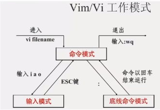
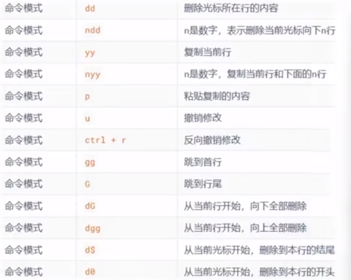
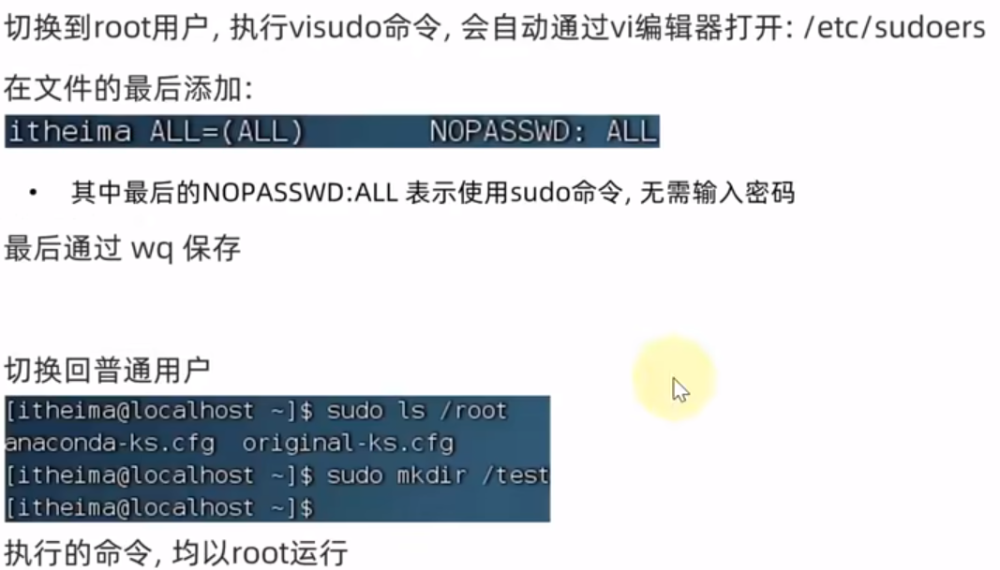
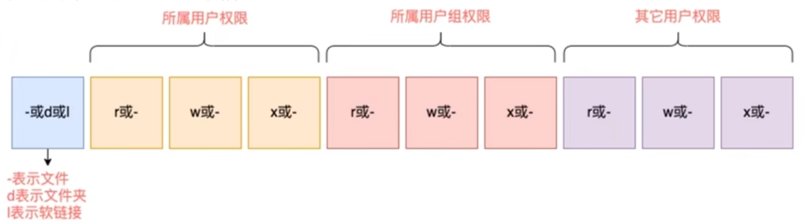
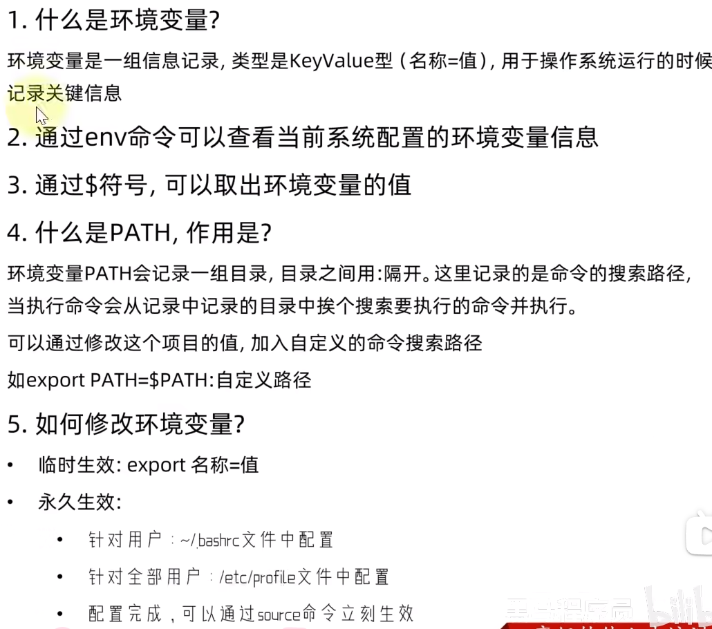

# 命令格式
command \[-options] \[parameter]
- command 命令本身
- optionns \[可选，非必填]命令的一些选项，可以通过选项控制命令的行为细节
- parameter \[可选，非必填]命令参数，多用于命令的指向目标等

**示例：**
ls -l /home/itheima , ls 是命令本身， -l 是选项， /home/itheima是参数
	**- 意思是以列表的形式\[-l]，显示对应目录的内容**
[***语法中的\[\]，表示可选的意思***](#q)
## 语法选项的组合使用
**示例：** 
- Is -l-a
- Is -la
- Is -al
# Linux命令
Liux命令，其实它们的本体就是一个个的二进制可执行程序和Windows:系统中的.exe文件，是一个意思。
# 当前工作目录和工作目录
Linux在启动时会默认加载：
- 当前登录用户的HOME目录为当前工作目录
	- HOME目录 每个Linux操作用户在系统中的个人账户目录，路径在：/home/用户名
	- Windows:系统和Linux系统，均设有用户的HOME目录
---
# 相对路径和绝对路径
- **绝对路径：以根目录为起点，描述路径的一种写法**，路径描述以/开头
- **相对路径：以当前目录为起点，描述路径的一种写法**，路径描述无需以/开头
## 特殊路径符
- `.` 表示当前目录，比如cd ./Desktop表示切换到当前目录下的Desktop目录内，和cd Desktop效果一致
- `..` 表示上一级目录，比如：cd .. 即可切换到上一级目录，cd ../.. 切换到上二级的目录
- `~` 表示HOME目录，比如：cd ~ 即可切换到HOME目录或cd~/Desktop,切换到HOME内的Desktop目录
# 通配符
rm命令支持通配符 \*，用来做模糊匹配
符号*表示通配符，即匹配任意内容（包含空），示例：
- test*,表示匹配任何以test开头的内容
- \*test,表示匹配任何以test结尾的内容
- \*test*,表示匹配任何包含test的内容
# 管道符
管道符的含义是：将管道符左边命令的结果，作为右边命令的输入
# 反引号
被包围的内容，会被作为命令执行，而非普通字符
# 重定向符号
- \> , 将左侧命令的结果，覆盖写入到符号右侧指定的文件中
- \>> , 将左侧命令的结果，追加写入到符号右侧指定的文件中
# vi\vim编辑器介绍
vi\vim是visual interface(可视化界面)的简称，是Linux中最经典的文本编辑器
同图形化界面中的文本编辑器一样，ⅵ是命令行下对文本文件进行编辑的绝佳选择。
vim是vi的加强版本，兼容vi的所有指令，不仅能编辑文本，而且还具有shell程序编辑的功能，可以不同颜色的字
体来辨别语法的正确性，极大方便了程序的设计和编辑性。
## vi\vim编辑器的三种工作模式
- 命令模式(Command mode)】
命令模式下，所敲的按键编辑器都理解为命令，以命令驱动执行不同的功能。
此模型下，不能自由进行文本编辑。
- 输入模式(Insert mode)
也就是所谓的编辑模式、插入模式。
此模式下，可以对文件内容进行自由编辑。
- 底线命令模式(Last line mode)】
以：开始，通常用于文件的保存、退出。

## 命令模式下相关命令
- 切换至插入模式（Insert mode）编辑文件

 	在「命令行模式（command mode）」下按一下字母「i」就可以进入「插入模式（Insert mode）」，这时候你就可以开始输入文字了。
- 退出vi及保存文件

	在「命令行模式（command mode）」下，按一下「：」冒号键进入「Last line mode」，例如：

	- : w filename （输入 「w filename」将文章以指定的文件名filename保存）
	- 
	- : wq (输入「wq」，存盘并退出vi)
	- 
	- : q! (输入q!， 不存盘强制退出vi)
更多命令参考[Linux vi/vim命令大全](https://www.runoob.com/linux/linux-vim.html "点击跳转")

# 为普通用户配置sudo认证
左边第一段是用户名

# root用户
在Liux系统中，拥有最大权限的账户名为：root(超级管理员)
而在前期，我们一直使用的账户是普通的用户：itheima
root用户拥有最大的系统操作权限，而普通用户在许多地方的权限是受限的。
# 各类权限

- -rwx权限
	- 表示读权限
	- w表示写权限
	- x表示执行权限
- 针对文件、文件夹的不同，rwx的含义有细微差别
	- r，针对文件可以查看文件内容
		- 针对文件夹，可以查看文件夹内容，如  -ls 命令
	- w, 针对文件表示可以修改此文件
		- 针对文件夹，可以在文件夹内：创建、删除、改名等操作
	- x,针对文件表示可以将文件作为程序执行
		- 针对文件夹，表示可以更改工作目录到此文件夹，即cd进入
# 端口
端口，是设备与外界通讯交流的出入口。端口可以分为：物理端口和虚拟端口两类
- 物理端口：又可称之为接口，是可见的端口，如USB接口，RJ45网口，HDMI端口等
- 虚拟端口：是指计算机内部的端口，是不可见的，是用来操作系统和外部进行交互使用的
# 进程
程序运行在操作系统中，是被操作系统所管理的。
为管理运行的程序，每一个程序在运行的时候，便被操作系统注册为系统中的一个：进程
并会为每一个进程都分配一个独有的：进程D(进程号)
通过ps -ef查看目前设备中的进程
# 查看环境变量
使用命令evn

