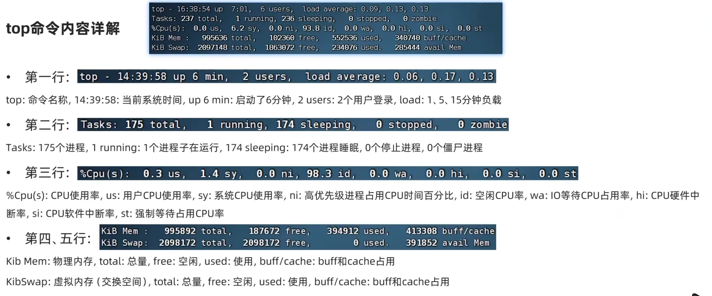
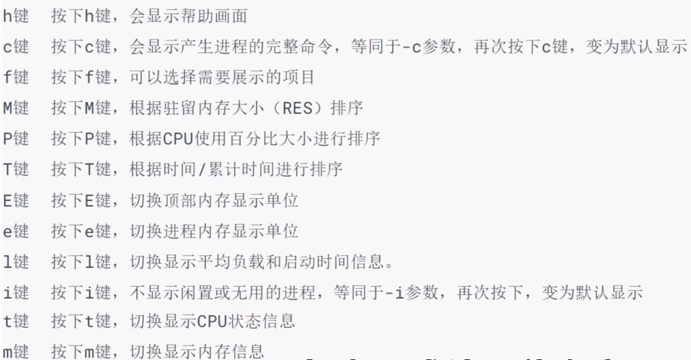
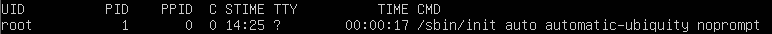
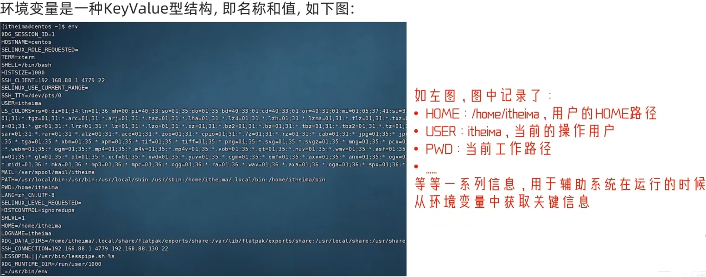
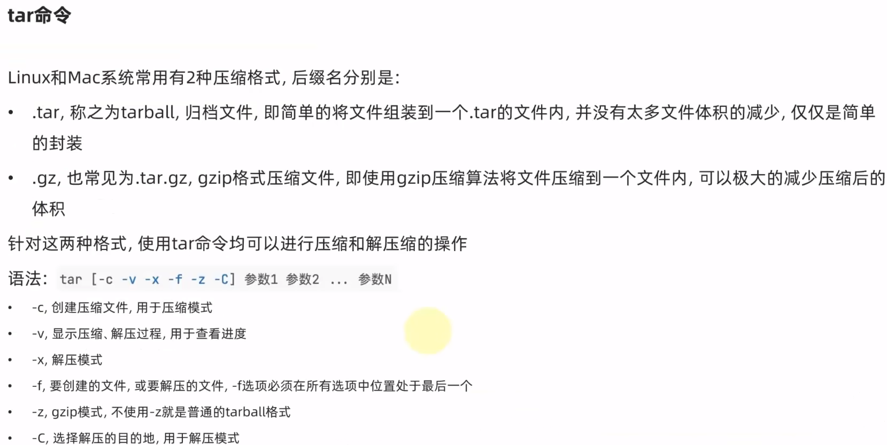
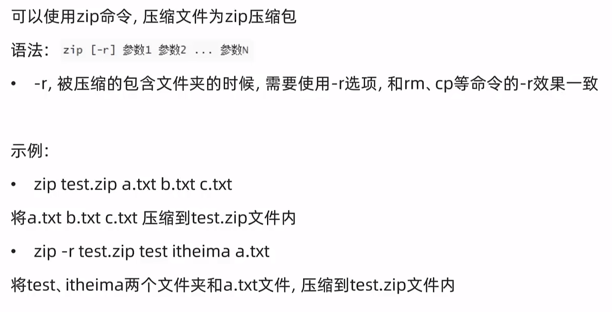
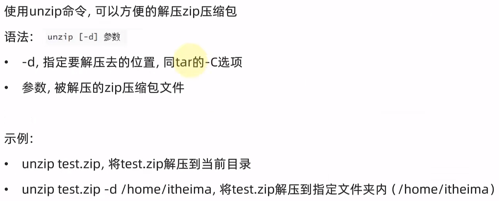

# yum命令 安装软件(ubantu 用 apt)
## 语法：`yum [-y] [instal | remove | search]软件名称`
yum:**RPM**包软件管理器*(这里就是为什么两个系统安装包管理器不一样的原因“安装包格式不同”)*，用于自动化安装配置Liux软件，并可以自动解决依赖问题。
- 选项：-y,自动确认，无需手动确认安装或卸载过程
	- install:安装
	- remove:卸载
	- search:搜索
- yum命令需要root权限，可以su切换到root,或使用sudo提权。
- yum命令需要联网
# apt命令
## 语法：`apt [-y] [install|remove|search] 软件名称`
apt:**deb**包管理器
用法和yum一致，同样需要root权限
- apt install wget,.安装wget
- apt remove wget,移除wget
- apt search wget,搜索wget
# systemctl命令
## 语法：`systemctl start(开启) stop(关闭)|status(查看)|enable(开机自启)|disable（关闭开机自启服务） 服务名`
Linux系统很多软件（内置或第三方）均支持使用systemctl命令控制：启动、停止、开机自启
能够被systemctl管理的软件，一般也称之为：服务
系统内置的服务比较多，比如：
- NetworkManager,主网络服务
- network,副网络服务
- firewalld,防火墙服务
- sshd,ssh服务(FinalShelli远程登录Linux使用的就是这个服务)
- # <a id="ping"></a>ping命令
## 语法：`ping[-c num] ip或主机名`
可以通过pig命令，检查指定的网络服务器是否是可联通状态
- 选项：-C,检查的次数，不使用-C选项，将无限次数持续检查
- 参数：ip或主机名，被检查的服务器的ip地址或主机名地址
# wget命令
## 语法：`wget [-b] url`
wgt是非交互式的文件下载器，可以在命令行内下载网络文件
- 选项：-b,可选，后台下载，会将日志写入到当前工作目录的wget-log文件
- 参数：url,下载链接
# curl命令
## 语法：`cur1 [-o] ur1`
curl可以发送http网络请求，可用于：下载文件、获取信息等
- 选项：-O,用于下载文件，当u是下载链接时，可以使用此选项保存文件
- 参数：ul,要发起请求的网络地址
# 软连接
## 语法：`ln -s 参数1 参数2`
在系统中创建软链接，可以将文件、文件夹链接到其它位置。
类似Windows系统中的《快捷方式》
- -S选项，创建软连接
- 参数1：被链接的文件或文件夹
- 参数2：要链接去的目的地
# date命令
查看日期，如果经常使用要进行调准，将时区改为上海时间。
# ntp 程序
可以通过ntp程序自动校准系统时间
安装ntp:yum-y install ntp
启动并设置开机自启：
- systemctl start ntpd
- systemctl enable ntpd
当ntpd启动后会定期的帮助我们联网校准系统的时间

时间不准时可以选择手动校准
**ntpdate -u ntp.aliyun.com**（Ubuntu20.04已经无法使用）
# ifconfig命令
需要先安装net-tools服务
## net-tools
`net-tools` 是一个 Linux 网络管理工具集，包括一些用于网络配置和监视的命令行工具。这个工具集包含了一些广泛使用的命令，例如 `ifconfig`、`arp`、`route`、`netstat` 等。

`ifconfig` 命令用于配置和管理网络接口，包括设置 IP 地址、子网掩码、广播地址等。

`arp` 命令用于显示和修改系统 ARP 缓存，可以查看本地网络中的设备 IP 和 MAC 地址对应关系。

`route` 命令用于配置和管理系统路由表，可以添加、删除、修改路由表项。

`netstat` 命令用于显示系统网络连接、网络接口、路由表、网络统计信息等。

**然而，在较新的 Linux 发行版中，如 Ubuntu 20.04，`net-tools` 已经被标记为过时的工具集，并且已经被替换为 `iproute2` 命令。`iproute2` 命令提供了类似的功能，并且更加强大和灵活。因此，建议在新的 Linux 系统上使用 `iproute2` 命令来代替 `net-tools` 命令。**

---
## iproute2
`iproute2` 是一个 Linux 网络管理工具集，包含了一些用于网络配置和监视的命令行工具，例如 `ip`、`ss`、`tc` 等。相比于传统的 `net-tools` 工具集，`iproute2` 提供了更加强大和灵活的网络管理功能，能够更好地满足复杂网络环境下的需求。

在大多数 Linux 发行版中，`iproute2` 已经预装在系统中，无需额外安装。您可以通过在终端中输入以下命令来检查是否已经安装了 `iproute2`：

```
ip -V
```

如果输出了版本信息，则表示已经安装了 `iproute2`。

如果您使用的是 Debian 或者 Ubuntu 等基于 Debian 的 Linux 发行版，并且您的系统中没有安装 `iproute2`，您可以通过以下命令来安装：

```
sudo apt-get update
sudo apt-get install iproute2
```

这将使用 apt 包管理器从软件源中下载并安装 `iproute2`。
### 相关的常用命令
`iproute2` 工具集包含了许多命令，以下是一些常用的命令及其功能：

- `ip addr`: 显示和管理网络接口的 IP 地址和状态。
- `ip link`: 显示和管理网络接口的状态、类型、MAC 地址等信息。
- `ip route`: 显示和管理系统路由表，包括添加、删除、修改路由表项等操作。
- `ip neigh`: 显示和管理系统 ARP 缓存，包括添加、删除、修改 ARP 缓存项等操作。
- `ip tunnel`: 显示和管理网络隧道，包括创建、删除、修改网络隧道等操作。
- `ip maddr`: 显示和管理多播组地址，包括加入、离开、查询多播组等操作。
- `ip netns`: 显示和管理网络命名空间，包括创建、删除、进入、退出网络命名空间等操作。
- `ss`: 显示和管理系统网络连接状态，包括 TCP、UDP、Unix 套接字等连接类型。

以上是一些常用的 `iproute2` 命令，您可以在终端中输入 `man ip`、`man ss` 等命令来查看命令的详细用法和参数说明。
# hostname 查看主机名 
hostnamectl set-hostname主机名，修改主机名（需root)
# 用户组管理命令
## 创建用户组
groupadd 用户组名
## 删除用户组
groupdel用户组名
# 用户管理
## 创建用户
`useradd [-g-d] 用户名`
- 选项：-g 指定用户的组，不指定-g,会创建同名组并自动加入，指定 -g需要组已经存在，如已存在同名组，必须使用-g
- 选项：-d指定用户HOME路径，不指定，HOME目录默认在：/home/用户名

## 删除用户
userdel[-r]用户名
- 选项：-r,删除用户的HONE目录，不使用-r,删除用户时，HOME目录保留
## 查看用户所属组
`id [用户名]`
- 参数：用户名，被查看的用户，如果不提供则查看自身
## 修改用户所属组
`usermod-aG 用户组 用户名`
- 将指定用户加入指定用户组
# 检查网络是否联通
使用[ping命令](../linux/基础命令.md#ping)
# 查访本地的地址本（域名文件）
Windows看  :CWindows\System32\drivers\etc\hosts
Linux看：/etc/hosts
# 查看端口占用
可以通过Linux命令去查看端口的占用情况
使用命令sudo lsof -i
# 查看系统资源占用
使用top（直接输入即可）默认5秒刷新一次

## top命令内容
- PID:进程id
- USER:进程所属用户
- PR:进程优先级，越小越高
- N:负值表示高优先级，正表示低优先级
- VIRT:进程使用虚拟内存，单位KB
- RES:进程使用物理内存，单位KB
- SHR:进程使用共享内存，单位KB
- S:进程状态(S休眠，R运行，Z僵死状态，N负数优先级，空闲状态)
- %CPU:进程占用CPU率
- %MEM:进程占用内存率
- TIME+:进程使用CPU时间总计，单位10毫秒
- COMMAND:进程的命令或名称或程序文件路径
## top命令也支持选项：
|选项|功能|
|:---:|:---|
|-p|只显示某个进程的信息|
|-d|设置刷新时间，默认是5s|
|-c|显示产生进程的完整命令，默认是进程名|
|-n|指定刷新次数，比如top -n 3,刷新输出3次后退出|
|-b|以非交互非全屏模式运行，以批次的方式执行top,一般配合-n指定输出几次统计信息，将输出重定向到指定文件，比如top -b - n 3 > /tmp/top.tmp|
|-i|不显示任何闲置(idle)或无用(zombie)的进程|
|-u|查找特定用户启动的进程|
## 交互式选项
当top以交互式运行(非-b选项启动)，可以用以下交互式命令进行控制

# ps命令
## 语法：`ps [-e -f]`
可以通过ps命令查看Liux系统中的进程信息
选项：-e,显示出全部的进程
选项：-f，以完全格式化的形式展示信息（展示全部信息）

- UID:进程所属的用户ID
- PID:进程的进程号ID
- PPD:进程的父ID(启动止进程的其它进程)
- C:此进程的CPU占用率（百分比）
- STME:进程的启动时间
- TTY:启动此进程的终端序号，如显示？，表示非终端启动
- TIME:进程占用CPU的时间
- CMD:进程对应的名称或启动路径或启动命令
# df命令
## 语法：`df [-h]`
查看硬盘使用情况
选项：-h,以更加人性化的单位显示
# 查看网络状态
## 语法：`sar -n DEV num1 num2`
选项：-n，查看网络，DEV表示查看网络接口
num1:刷新间隔（不填就查看一次结束），num2:查看次数（不填无限次数）
# 环境变量
使用env命令进行查看

# 压缩和解压
## tar

- 常用压缩命令：
`tar -cvf test.tar 1.txt 2.txt 3.txt`
将1.txt 2.txt 3.txt 压缩到test.tar文件内
`tar -zcvf test.tar.gz 1.txt 2.txt 3.txt`
将1.txt 2.txt 3.txt 压缩到test.tar.gz文件内，使用gzip模式
- 常用解压命令：
`tar -xvf test.tar`
解压test.tar,将文件解压至当前目录
`tar -xvf test.tar -C /home/itheima`
解压test.tar,将文件解压至指定目录(/home/itheima)
`tar -zxvf test.tar.gz-C /home/itheima`
以Gzip模式解压test.tar.gz,将文件解压至指定目录（/home/itheima)
## zip 

## unzip
